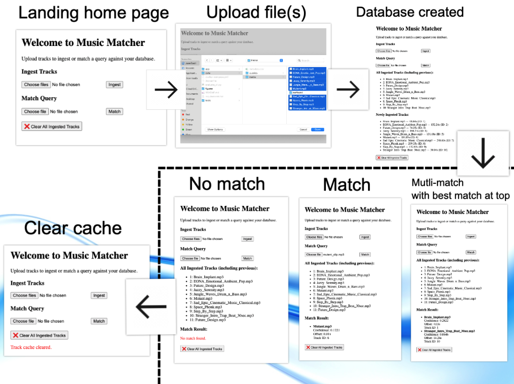
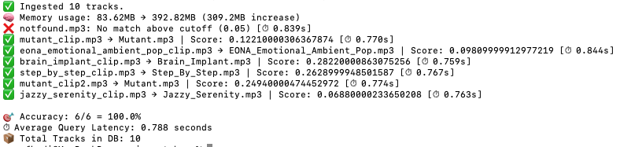

# music_matcher
Test app to match music.

This was inspired by [Will Drevo's blog post on audio fingerprinting](https://willdrevo.com/fingerprinting-and-audio-recognition-with-python/). This is a lightweight Shazam-style custom implementation of Dejavu's fingerprinting concept.

---

Features:
- Upload `.mp3` or `.wav` files via web interface.
- Generate database of fingerprints and match noisy audio clips
- Real-time match with timestamp offset and confidence score
- CLI evaluator for benchmarking accuracy, latency, and memory
- Automated test suite with Pytest
- Fully containerised via Docker
- Modern FastAPI frontend with HTML/Jinja templates



---

How it works:
  Audio loading:
- As a proof of concept, this app utilises simple in-memory storage.
- To support ingesting both MP3 and WAV files, this app uses librosa.load(), which decodes using audioread and ffmpeg.
- Fingerprints are stored as normalised waveforms.
- Query clips are matched by cross-correlation against all stored tracks
- The matches are returned with confidence and offset - where the best match is shown.

---

Testing:
- For positive testing, all 10 tracks are loaded, pre-generated query clips are then randomly selected and checked against the database. Tests pass if the query matches against the known matching track and fails if it mis-matches.
- For negative testing, a track not within the database has been sampled and this is posed as a query. Test passes when this fails to match.
- For testing file type, a non .wav .mp3 file is attempted to be ingested. Test passes when this fails.
- A CLI evaluation approach is also incorporated which benchmarks the app's accuracy, memory usage, average query latency and provides data on match scoring for each sample against the known origin track.
  


---

## Setup

```bash
git clone https://github.com/your-user/music_matcher.git
cd music_matcher
pip install -r requirements.txt
uvicorn app.main:app --reload
```

### Or use Docker:
```bash
docker-compose up --build
```

Then go to [http://localhost:8000](http://localhost:8000) to upload or match tracks.

## Project Structure

```
├── app/
│   ├── main.py               # FastAPI app + logic
│   └── templates/index.html  # Web UI
├── data/
│   ├── tracks/               # Audio clips the user can ingest via the web app
│   └── queries/              # Query clips the user can utilise to perform queries
├── tests/                    # Pytest test suite
├── evaluate.py               # CLI evaluator
├── Dockerfile
├── Figures
├── requirements.txt
└── README.md
```

## 📈 For Scaling and Production

See [`design.md`](design.md) for a full breakdown of how this app could be productionised into a high-availability service. Topics covered:

### 🏗️ Architecture
- Components: ingestion, fingerprinting, storage, API
- Async processing, batching, fault tolerance

### ☁️ Infrastructure
- DB, queueing, object storage, secrets
- Container orchestration
- API auth and rate limiting

### 🔁 CI/CD
- Tests: unit, integration
- CI pipeline (GitHub Actions / Jenkins)
- Staging → production release gating
- Monitoring/logging

### 👥 Team Practices
- Project structure and coding standards
- Branching, documentation, PR review process
